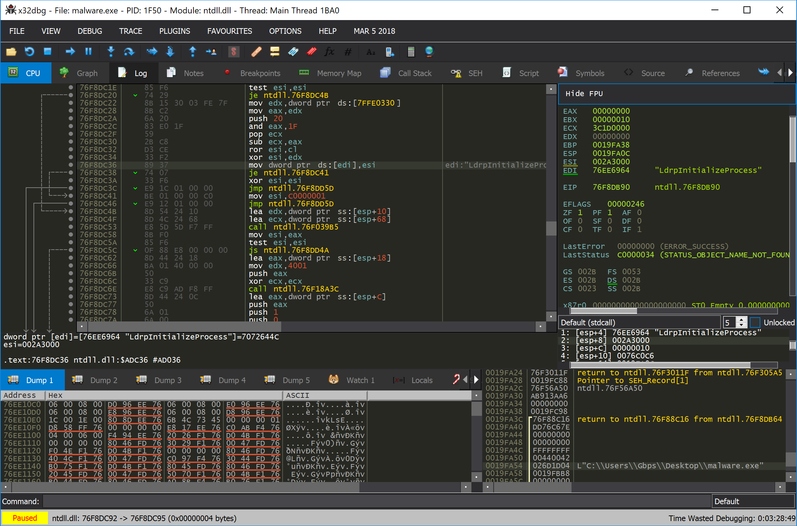

# x64dbg-consonance-theme
My dark x64dbg color theme based on [IDA Consonance](https://github.com/eugeii/ida-consonance)

Dark style.css theme from [x64dbg_Theme_vs_dark](https://github.com/Voraka/x64dbg_Theme_vs_dark)

## Installation
1) Place **style.css** into the same directory as **x64dbg.exe** or **x32dbg.exe**
2) Import **consonance.ini** into x32dbg/x64dbg using **Options -> Import settings** in the top menu bar
3) Restart the debugger

## Preview

